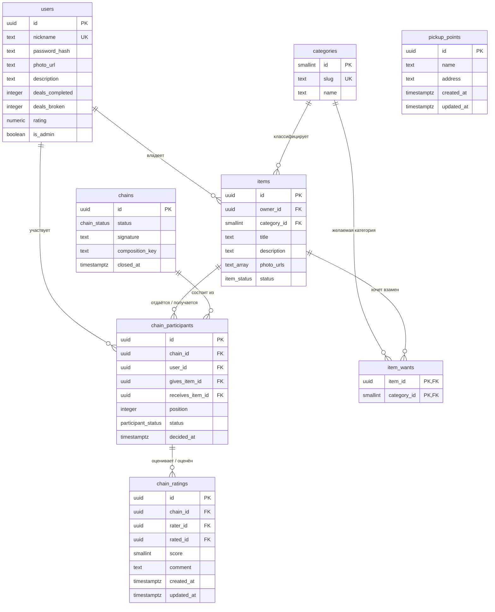

# База данных

Схема сервиса многостороннего обмена: пользователи, вещи, желания, цепочки обмена.

## Почему PostgreSQL

Сравнивали PostgreSQL, MySQL, SQLite, MongoDB и графовую БД (Neo4j).

**Выбран PostgreSQL:**

- Строгая реляционная модель ложится на `Item / Want / Chain / ChainParticipant` вместе с
  FK-констрейнтами — целостность цепочки держит БД, а не надежда на аккуратность кода.
- ACID-транзакции критичны: блокировка вещи при согласии участника и переходы состояния
  цепочки — это и есть честность сделки. Без транзакций одну вещь можно пообещать двум
  цепочкам сразу.
- `WITH RECURSIVE` под рукой, если поиск циклов окажется дешевле делать в БД, а не в Go.
- `JSONB` закроет гибкие атрибуты вещи, если понадобятся, без ухода от реляционности.
- Зрелая экосистема в Go: `pgx`, `sqlc`, `goose`.

**Отклонено:**

| Вариант | Почему нет |
|---|---|
| MySQL | Не даёт ничего сверх Postgres для этой задачи |
| SQLite | Слабая параллельная запись; сервис должен быть доступен в интернете нескольким пользователям сразу |
| MongoDB | Целостность цепочки и state machine выражаются реляционными констрейнтами лучше, чем документной моделью |
| Neo4j | Оверинжиниринг: цепочки короткие (2–5 узлов), поиск циклов на таком объёме прекрасно живёт в SQL/Go. Сервис ради сервиса |

## Схема



Цикл обмена читается так: у Алисы велосипед, она хочет приставку; у Боба приставка, он
хочет смартфон; у Кэрол смартфон, она хочет велосипед. Цепочка замыкается — каждый отдаёт
одну вещь и получает одну вещь:

| position | участник | отдаёт | получает |
|---|---|---|---|
| 0 | alice | велосипед | приставка |
| 1 | bob | приставка | смартфон |
| 2 | carol | смартфон | велосипед |

## Типы данных

### `users`

| Колонка | Тип | Почему такой |
|---|---|---|
| `id` | `uuid` DEFAULT `gen_random_uuid()` | ID появляется в публичных URL; последовательные числа позволяли бы перебирать чужие профили. `gen_random_uuid()` в ядре Postgres с 13 версии, расширение не нужно |
| `nickname` | `text` + CHECK 3..32 | В PostgreSQL `text` не медленнее `varchar(n)`; ограничение длины выражено CHECK явно. Уникальность регистронезависимая — отдельный `UNIQUE INDEX (lower(nickname))` вместо `citext`, чтобы не тянуть расширение |
| `password_hash` | `text` | Длина зависит от алгоритма (bcrypt 60, argon2id ~100); фиксировать её `varchar(n)` — значит ловить обрезание при смене алгоритма |
| `photo_url` | `text` NULL | Аватар не обязателен, NULL здесь осмысленный |
| `description` | `text` NOT NULL DEFAULT `''` | «О себе» пустое по умолчанию: пустая строка и NULL значили бы одно и то же, поэтому NULL исключён |
| `deals_completed` / `deals_broken` | `integer` NOT NULL DEFAULT 0, CHECK `>= 0` | Счётчики; отрицательное значение — всегда баг, CHECK ловит его в БД |
| `rating` | `numeric(3,2)` NULL, CHECK 0..5 | Средняя оценка: `numeric` точен на дробях, в отличие от `real/double`. NULL = оценок ещё не было, это не то же самое, что 0.00. Пишет только триггер `refresh_user_rating` |
| `ratings_count` | `integer` NOT NULL DEFAULT 0, CHECK `>= 0` | Сколько оценок собрано. Без него «0.00» новичка и честный ноль неразличимы на экране — то самое различие, которое защищает NULL в `rating` |
| `is_admin` | `boolean` NOT NULL DEFAULT false | Право доступа к `/admin`; отдельная таблица администраторов не нужна |
| `created_at` / `updated_at` | `timestamptz` | Всегда `timestamptz`, а не `timestamp`: без таймзоны момент времени неопределён |

### `categories`

| Колонка | Тип | Почему такой |
|---|---|---|
| `id` | `smallint GENERATED ALWAYS AS IDENTITY` | Справочник на десяток строк, данные публичные — перебирать нечего, uuid дал бы только вес. `IDENTITY` — стандарт SQL, в отличие от `serial` |
| `slug` | `text UNIQUE` | Стабильный машинный ключ для фронта и матчинга, не зависит от переименования |
| `name` | `text` | Отображаемое название |

### `items`

| Колонка | Тип | Почему такой |
|---|---|---|
| `id` | `uuid` | Как у `users` — публичный идентификатор |
| `owner_id` | `uuid` FK → `users` ON DELETE CASCADE | Вещь без владельца бессмысленна; уходит вместе с ним |
| `category_id` | `smallint` FK → `categories` ON DELETE RESTRICT | Категория — половина ребра графа обмена; удалить её из-под живых вещей нельзя |
| `title` | `text` CHECK 1..120 | Короткая подпись для списка; пустое название запрещено |
| `description` | `text` NOT NULL DEFAULT `''` | Подробности не обязательны |
| `photo_urls` | `text[]` NOT NULL + CHECK `cardinality BETWEEN 1 AND 10` | Фотографий несколько, и хотя бы одна обязательна: объявление без фото — пустая карточка. Массив, а не отдельная таблица: порядок показа — это порядок массива, а `cardinality()` в CHECK видит весь список, из отдельной таблицы то же правило выражалось бы только триггером |
| `status` | `item_status` | ENUM `available / reserved / traded / withdrawn` — весь жизненный цикл вещи |

### `item_wants`

| Колонка | Тип | Почему такой |
|---|---|---|
| `item_id`, `category_id` | составной PRIMARY KEY | Пара «вещь — желаемая категория» уникальна по определению, отдельный суррогатный ключ здесь лишний |

Хотя бы одно желание на вещь требует API (`internal/item/service`), а не БД: строки лежат в
отдельной таблице, и «не меньше одной» там выражается только триггером — цена выше, чем
польза. Вещь без желаний в БД возможна, через `POST /items` не создаётся.

### `pickup_points`

| Колонка | Тип | Почему такой |
|---|---|---|
| `id` | `uuid` | Публичный идентификатор ПВЗ для административного API |
| `name` | `text` CHECK 1..120 | Короткое понятное название; пустые строки запрещены |
| `address` | `text` CHECK 1..500 | Адрес обязателен, ограничение защищает от случайно огромных значений |
| `created_at` / `updated_at` | `timestamptz` | История создания и последнего изменения ПВЗ |

Связь объявления с ПВЗ добавляется отдельной задачей вместе с логикой местонахождения
товара. Когда появится внешний ключ `items.pickup_point_id`, он должен использовать
`ON DELETE RESTRICT`: используемый объявлениями ПВЗ удалить нельзя. Repository уже
переводит такое нарушение внешнего ключа в ответ API `409 Conflict`.

### `chains`

| Колонка | Тип | Почему такой |
|---|---|---|
| `id` | `uuid` | Публичный идентификатор цепочки |
| `status` | `chain_status` | ENUM `proposed / confirmed / delivering / delivered / completed / cancelled` |
| `cancel_reason` | `chain_cancel_reason` NULL | Причина обязательна для `cancelled`, у остальных статусов равна NULL |
| `signature` | `text` | Канонический набор направленных передач; одинаков для разных стартовых точек одного обхода |
| `composition_key` | `text` | Отсортированные ID отдаваемых вещей; одинаков для любых перестановок и направлений одного состава |
| `closed_at` | `timestamptz` NULL | Заполняется в терминальном состоянии; NULL = цепочка ещё живая |

### `broken_exchange_compositions`

| Колонка | Тип | Почему такой |
|---|---|---|
| `composition_key` | `text` PRIMARY KEY | Постоянно запрещённый точный набор объявлений сорванного confirmed-обмена |
| `source_chain_id` | `uuid` UNIQUE FK | Исторический обмен, из-за которого появился запрет |
| `created_at` | `timestamptz` | Когда состав был исключён |

### `chain_participants`

| Колонка | Тип | Почему такой |
|---|---|---|
| `chain_id` | `uuid` FK ON DELETE CASCADE | Участник вне цепочки не существует |
| `user_id` | `uuid` FK ON DELETE RESTRICT | Удаление пользователя не предусмотрено (issue #4 — CRU без D), и уж точно не из-под живой цепочки |
| `gives_item_id` / `receives_item_id` | `uuid` FK ON DELETE RESTRICT | Вещь, участвующая в обмене, не может исчезнуть |
| `position` | `integer` CHECK `>= 0` | Порядок в цепочке — его показывают пользователю («кто ещё участвует») |
| `status` | `participant_status` | ENUM `pending / accepted / declined` |
| `decided_at` | `timestamptz` NULL | NULL, пока участник не принял решение |

### `chain_ratings`

| Колонка | Тип | Почему такой |
|---|---|---|
| `chain_id` + `rater_id` | `uuid` композитный FK на `chain_participants (chain_id, user_id)` ON DELETE CASCADE | Оценивать можно только внутри своей цепочки — это факт базы, а не проверка в сервисе. Целевой `UNIQUE` там уже есть, отдельный индекс не нужен |
| `chain_id` + `rated_id` | `uuid` композитный FK туда же | Оценить постороннего нельзя по той же причине. Прямой FK на `users` был бы вторым забором вокруг того же поля: `chain_participants.user_id` уже ссылается туда |
| `score` | `smallint` CHECK 1..5 | Шкала закрытая, `smallint` — её естественная ширина |
| `comment` | `text` NOT NULL DEFAULT `''`, CHECK ≤ 2000 | Столько же, сколько у сообщения обмена и комментария к жалобе. Пустой комментарий — `''`: «не написал» и «написал пустоту» здесь одно и то же |
| `created_at` / `updated_at` | `timestamptz` | `updated_at` — единственный след правки оценки, и наружу он не отдаётся: время правки выдаёт автора анонимного отзыва |
| `UNIQUE (chain_id, rater_id)` | — | Одна оценка на участника. Он же арбитр `ON CONFLICT` при перезаписи и лукап «моя оценка в этом обмене» |
| `CHECK (rater_id <> rated_id)` | — | Партнёр выводится джойном по вещам, а не приходит от клиента; CHECK ловит тот единственный случай, когда этот вывод сломается, и прямые `INSERT` мимо запроса |

Индекс один: `(rated_id, created_at DESC, id DESC)` — под ленту отзывов о человеке.
`ON DELETE CASCADE` достижим только через `DELETE FROM chains`: участников не удаляют, отказ
меняет статус. Так чистят за собой интеграционные тесты, и ровно поэтому триггер пересчёта
обрабатывает `DELETE`.

## Решения, которые стоит знать

**Почему статусы — ENUM, а не `text` + CHECK.** sqlc генерирует из ENUM типизированные
Go-константы (`ChainStatusProposed`), опечатка в статусе ловится компилятором. Цена —
добавление значения потом требует миграции с пометкой `-- +goose NO TRANSACTION`, потому
что `ALTER TYPE ... ADD VALUE` не идёт внутри транзакции.

**Почему у `chains` нет статуса `accepted`.** Согласие — свойство участника, а не цепочки:
оно живёт в `chain_participants.status`.

**Как вещь не попадает в две цепочки сразу.** Через `items.status`: при согласии участника
транзакция берёт строку вещи `SELECT ... FOR UPDATE`, проверяет `available` и переводит в
`reserved`. Второй параллельной цепочке достаётся уже `reserved`, и она отваливается.
Частичного unique-индекса по `chain_participants` намеренно нет: он не видит статус
цепочки и залочил бы вещь навсегда после отмены обмена.

Пока обмен только `proposed`, одна вещь может находиться в нескольких разных вариантах:
пользователь выбирает лучший. Но один и тот же набор вещей не дублируется благодаря
частичному unique-индексу по `chains.composition_key`. Когда один вариант подтверждён,
транзакция резервирует вещи и отменяет все конкурирующие предложения.

**Почему «хочу» привязано к вещи, а не к пользователю.** `item_wants(item_id, category_id)`
делает ребро графа однозначным: эта вещь отдаётся за эту категорию. Если желания привязать
к пользователю, то при двух вещах и двух желаниях матчинг не знает, что за что отдаётся.
Несколько строк на одну вещь читаются как ИЛИ.

**Почему `updated_at` обновляет триггер.** Так его не забудет ни один запрос — это дешевле,
чем дописывать `updated_at = now()` в каждый UPDATE и однажды пропустить.

## Запуск

```bash
cp .env.example .env
make up              # postgres + накат миграций
make smoke           # проверка схемы на живой БД
```

Прочее: `make migrate-status`, `make migrate-up`, `make migrate-down` (на шаг назад),
`make reset` (снести том и подняться с нуля), `make sqlc` (перегенерировать Go-код после
правки `migrations/` или `queries/`).

Миграции вшиты в бинарь через `embed.FS`, goose CLI на машине не нужен — всё катает
`cmd/migrate`.
